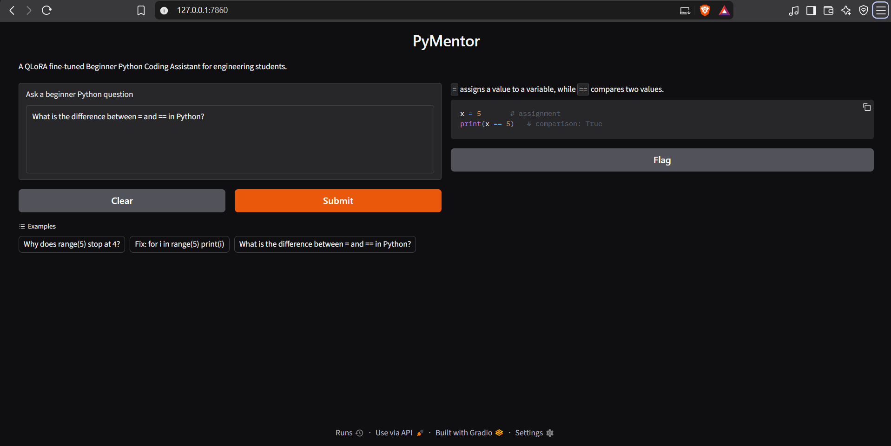

# PyMentor: QLoRA Fine-Tuned Beginner Python Tutor

PyMentor is a beginner-focused Python coding assistant fine-tuned using **QLoRA**. It adapts `Qwen/Qwen2.5-Coder-0.5B-Instruct` to provide short, clear, beginner-friendly Python explanations and examples.

## 1. Project Objective

The goal of PyMentor is to help engineering students and Python beginners understand common programming concepts through:

- Short explanations
- Beginner-friendly language
- Simple Python examples
- Direct answers to common questions
- Consistent tutoring-style responses

The project demonstrates dataset preparation, instruction fine-tuning, QLoRA, local GPU inference, model comparison, and a Gradio interface.

## 2. Demo

The application currently runs locally through Gradio.

```bash
python app.py
```

The terminal will display a local URL similar to:

```text
http://127.0.0.1:7860
```

Open that URL in a browser.

> **Public demo:** Not currently deployed. The current demo is local.

### Gradio interface screenshot

Insert a screenshot of the running application here:



## 3. System Workflow

```text
Raw Dataset
    |
    v
Data Cleaning and Formatting
    |
    v
Train / Validation / Test Split
    |
    v
QLoRA Fine-Tuning
    |
    v
Trained LoRA Adapter
    |
    v
Base Model + LoRA Adapter
    |
    v
Gradio Interface
```

The workflow is:

1. Collect beginner Python questions and answers.
2. Clean and format the examples as instruction-tuning data.
3. Split the dataset into training, validation, and test sets.
4. Fine-tune the model using QLoRA.
5. Save the trained LoRA adapter separately.
6. Load the base model and adapter during inference.
7. Provide answers through the Gradio interface.

## 4. Model Used

| Property | Value |
|---|---|
| Model | `Qwen/Qwen2.5-Coder-0.5B-Instruct` |
| Model type | Instruction-tuned causal language model |
| Approximate parameter count | 0.5 billion |
| Fine-tuning method | QLoRA |
| Quantization | 4-bit NF4 |
| Adapter | LoRA |
| Adapter path | `outputs/pymentor-0.5b-qlora/final_adapter` |

The model was selected because it is coding-oriented, instruction-tuned, and small enough to experiment with on a consumer laptop GPU.

## 5. Hardware and Software

### Hardware

| Component | Specification |
|---|---|
| CPU | Intel Core i5-13450HX |
| GPU | NVIDIA RTX 4050 Laptop GPU |
| GPU memory | 6 GB VRAM |
| System memory | 16 GB RAM |
| Operating system | Windows |

### Main software and libraries

- Python
- PyTorch
- Hugging Face Transformers
- Hugging Face Datasets
- PEFT
- BitsAndBytes
- QLoRA
- Gradio
- CUDA

Dependencies are defined in `pyproject.toml` and `uv.lock`.

## 6. Why QLoRA Was Used

Full fine-tuning updates the parameters of the entire model and requires considerably more GPU memory. With a 6 GB laptop GPU, this would be impractical for the current setup.

QLoRA reduces memory requirements by:

1. Loading the base model in 4-bit precision.
2. Keeping most base-model parameters frozen.
3. Training small LoRA adapter matrices.
4. Updating only a small number of trainable parameters.

The original base model remains separate from the trained adapter. During inference, the adapter is applied to the base model.

## 7. Dataset

The dataset contains **300 beginner Python examples**.

| Split | Examples |
|---|---:|
| Training | 240 |
| Validation | 30 |
| Test | 30 |
| **Total** | **300** |

The test set was held out during training and used for the base-model versus fine-tuned-model comparison.

### Dataset preparation

The preparation process involved:

1. Collecting beginner-oriented Python questions and answers.
2. Cleaning the raw examples.
3. Formatting them into conversational instruction data.
4. Splitting them into training, validation, and test sets.
5. Saving the processed data as JSONL files.

The processed data is stored under `data/processed/`.

## 8. Training Configuration and Results

| Property | Value |
|---|---|
| Fine-tuning method | QLoRA |
| Epochs | 3 |
| Training steps | 90 |
| Final training loss | Approximately `0.4038` |
| Evaluation loss | Approximately `0.09986` |
| Training duration | Approximately 26 minutes |
| GPU | RTX 4050 Laptop GPU |
| Available VRAM | 6 GB |

## 9. Inference Pipeline

The inference process is:

1. Load the tokenizer.
2. Load the base model in 4-bit precision.
3. Load the LoRA adapter.
4. Apply the PyMentor system prompt.
5. Generate the answer.
6. Display the answer in Gradio.

The current generation configuration includes:

```python
max_new_tokens=64
do_sample=False
use_cache=True
```

## 10. Response-Time Analysis

The model runs locally rather than through a remote inference API. During testing, response times varied from approximately 10 to 30 seconds, while the first response could take longer.

### Main reasons for the latency

**Model initialization:** The first request can include CUDA initialization, GPU memory allocation, kernel setup, and cache initialization.

**Autoregressive generation:** The model generates one token at a time. Longer answers require more sequential computation.

**Limited VRAM:** The RTX 4050 Laptop GPU has 6 GB of VRAM. Memory is required for model weights, the LoRA adapter, input tokens, activations, and the key-value cache.

**Quantization overhead:** 4-bit quantization primarily reduces memory usage. It does not guarantee that every operation will be proportionally faster. Some operations may require dequantization or specialized kernels.

**Software environment:** The application runs on Windows. Some optimized machine-learning kernels may have better support on Linux. The training logs also showed a `triton not found` warning; this does not necessarily indicate a model failure.

**Prompt and output length:** Longer prompts and outputs require more computation. Different questions can therefore have different response times.

### Why `max_new_tokens=64` was retained

Increasing the limit to 128 or 256 could produce longer answers, but it could also increase the maximum generation time. Because PyMentor targets short beginner explanations, 64 tokens was retained as a practical compromise between response quality and speed.

The trade-off is that some answers may be truncated. This limitation is recorded in the evaluation documentation.

## 11. Evaluation Methodology

Ten held-out beginner Python questions were used.

For each question, two responses were generated:

1. The original base model response.
2. The response from the base model with the QLoRA adapter enabled.

The criteria were:

- Technical correctness
- Beginner clarity
- Helpfulness
- Code quality

Each criterion was scored from 1 to 5.

| Score | Meaning |
|---:|---|
| 1 | Poor |
| 2 | Needs major improvement |
| 3 | Acceptable |
| 4 | Good |
| 5 | Excellent |

## 12. Preliminary Results

The following are **manual and preliminary scores**. Several responses were truncated because the evaluation used a 64-token generation limit, so these results are not a formal statistical benchmark.

| Metric | Base Model | Fine-Tuned Model |
|---|---:|---:|
| Technical correctness | 3.4/5 | 4.9/5 |
| Beginner clarity | 2.8/5 | 4.5/5 |
| Helpfulness | 2.5/5 | 4.4/5 |
| Code quality | 1.9/5 | 4.4/5 |
| **Overall average** | **2.65/5** | **4.55/5** |

Detailed results are available in:

- `results/comparison_examples.md`
- `results/comparison_results.json`
- `results/metrics.json`
- `docs/evaluation.md`

The fine-tuned model generally produced shorter, more direct, beginner-oriented answers and more consistent examples.

The evaluation also revealed that the duplicate-removal explanation should be improved because `dict.fromkeys()` requires hashable elements.

## 13. Project Structure

```text
pymentor-finetuning/
├── app.py
├── README.md
├── pyproject.toml
├── uv.lock
├── data/
│   ├── raw/
│   └── processed/
│       ├── train.jsonl
│       ├── validation.jsonl
│       └── test.jsonl
├── src/
│   ├── inference.py
│   ├── evaluate.py
│   └── ...
├── outputs/
│   └── pymentor-0.5b-qlora/
│       └── final_adapter/
├── results/
│   ├── comparison_examples.md
│   ├── comparison_results.json
│   └── metrics.json
└── docs/
    ├── evaluation.md
    └── images/
        ├── gradio-interface.png
        ├── architecture.png
        ├── dataset-example.png
        ├── training-results.png
        └── evaluation-comparison.png
```

## 14. Installation and Usage

### Clone the repository

```bash
git clone https://github.com/Reddi2802/pymentor-finetuning.git
cd pymentor-finetuning
```

### Create a virtual environment

On Windows PowerShell:

```powershell
python -m venv .venv
.venv\Scripts\Activate.ps1
```

### Install dependencies

The project uses `pyproject.toml` and `uv.lock`. If `uv` is installed:

```powershell
uv sync
```

Then activate the environment if required:

```powershell
.venv\Scripts\Activate.ps1
```

### Run the application

```powershell
python app.py
```

### Run evaluation

```powershell
python src/evaluate.py
```

The evaluation output is saved under `results/`.

## 15. Limitations

- The dataset contains only 300 examples.
- Only 10 held-out questions were manually evaluated.
- Some responses were truncated by the 64-token limit.
- The evaluation scores are manually assigned and preliminary.
- The model is intended for beginner Python questions, not advanced programming tasks.
- The duplicate-removal explanation needs refinement.
- Local inference latency depends on hardware, software versions, memory usage, and output length.
- The application is not publicly deployed.

## 16. Future Improvements

- Expand the dataset with more Python topics.
- Add examples involving exceptions, files, classes, debugging, and object-oriented programming.
- Increase the number of evaluation questions.
- Use multiple evaluators.
- Add automated execution and validation of generated Python code.
- Measure tokens per second and peak GPU memory.
- Add response streaming.
- Add a FastAPI backend.
- Add Docker support.
- Deploy to a cloud GPU service.
- Perform a separate evaluation using a larger generation limit.

## 17. Repository and Project Status

- [GitHub repository](https://github.com/Reddi2802/pymentor-finetuning)
- Local demo: Available after running `python app.py`
- Public deployment: Not currently available

## 18. Conclusion

PyMentor demonstrates how a small coding-oriented language model can be adapted into a focused beginner Python tutor using QLoRA on consumer hardware.

The project completed dataset preparation, train/validation/test splitting, QLoRA fine-tuning, adapter saving, local inference, a Gradio interface, base-model comparison, preliminary evaluation, and documentation.

The results suggest that the fine-tuned model produced more concise and beginner-oriented answers for the selected questions. However, the limited dataset size, small evaluation set, and 64-token generation limit mean that the results should be interpreted as an initial evaluation rather than a definitive benchmark.
